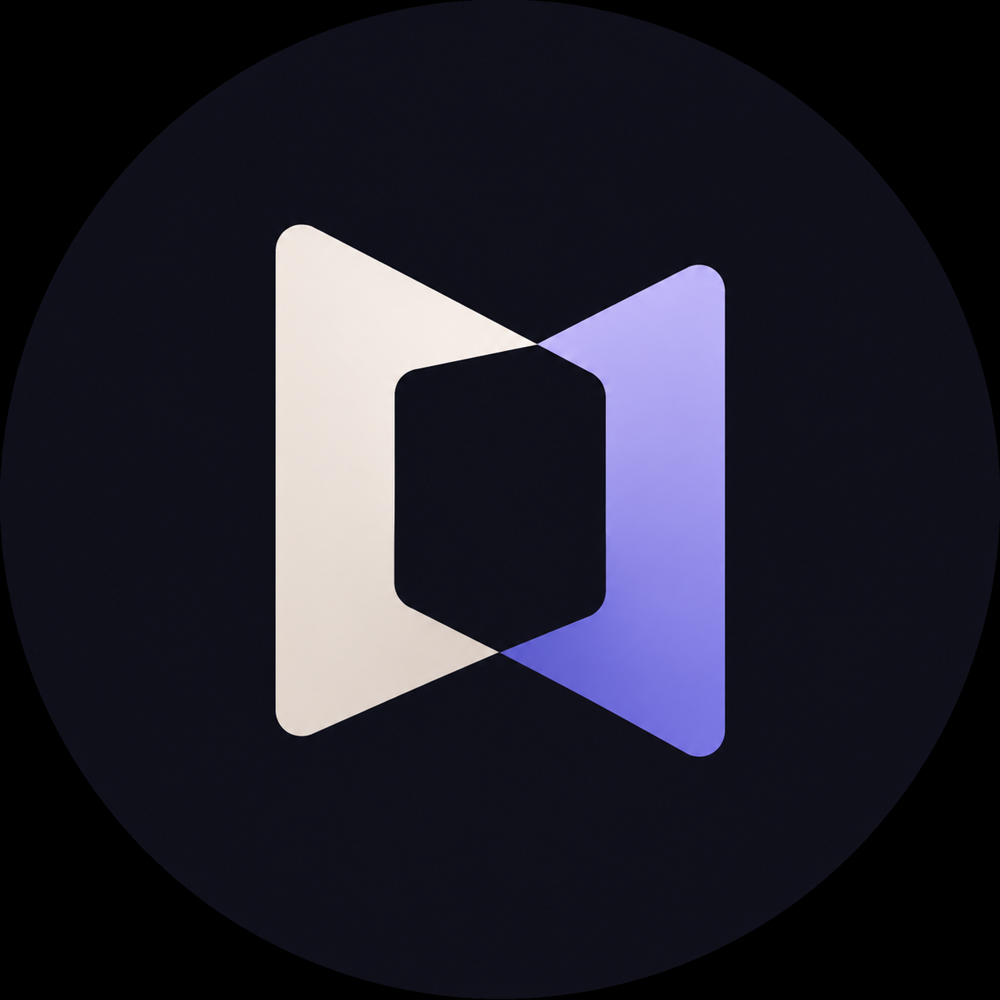

<p align="center">
  
</p>

<h1 align="center">OpenClaude</h1>

<p align="center">
  Use <strong>Claude Code</strong> and <strong>Claude Desktop</strong> with any AI provider.
  <br>
  Pick a provider, paste your key, click apply. No config files, no terminal tricks.
</p>

<p align="center">
  <a href="https://github.com/Superior-curtis/OpenClaude/releases/latest"></a>
  <a href="https://github.com/Superior-curtis/OpenClaude/blob/main/TUTORIAL.md"></a>
  
  
</p>

---

## What it does

OpenClaude is a desktop app that configures Claude Code and Claude Desktop to talk to the AI provider of your choice instead of Anthropic's API. It handles protocol translation, model filtering, and backup automatically.

- **Claude Code** — writes provider environment variables into `~/.claude/settings.json`
- **Claude Desktop** — configures the built-in Gateway mode with your provider endpoint
- **Protocol translation** — OpenAI-protocol providers (Groq, Together, etc.) route through a local proxy that translates to Anthropic's format and back
- **Model name routing** — shows real model names in Claude Desktop's model picker by working around its Claude-only validation
- **Auto-detection** — scans your system for Claude installations on startup

## Download

| Platform | Download |
|----------|----------|
| **macOS** Apple Silicon | `OpenClaude-0.1.0-arm64.dmg` |
| **macOS** Intel | `OpenClaude-0.1.0-x64.dmg` |
| **Windows** x64 | `OpenClaude-Setup-0.1.0-x64.exe` |
| **Windows** 32-bit | `OpenClaude-Setup-0.1.0-ia32.exe` |
| **Linux** x64 | `.AppImage` or `.deb` |
| **Linux** ARM64 | `-arm64.AppImage` or `_arm64.deb` |

**[All downloads →](https://github.com/Superior-curtis/OpenClaude/releases/latest)**

> macOS shows a warning on first launch because the app is not signed with a paid Apple Developer certificate. Right-click → Open to bypass. Same for Windows SmartScreen — click "More info" → "Run anyway". This is standard for open-source apps.

## Quick start

1. **Pick a provider** from the 16 presets, or enter a custom URL
2. **Paste your API key** and click Load models
3. **Pick models** for main and fast tasks
4. **Click Apply** for Claude Code, Claude Desktop, or both

Switch back to official Anthropic anytime — one click on Reset. Full walkthrough in the [tutorial](TUTORIAL.md).

## Providers

OpenRouter · OpenAI · Anthropic · Google Gemini · xAI Grok · DeepSeek · Mistral AI · Groq · Together AI · Fireworks AI · Cerebras · Perplexity · Z.AI · NVIDIA NIM · OpenCode Go · OpenCode Zen · Custom

## Develop

```bash
git clone https://github.com/Superior-curtis/OpenClaude.git
cd OpenClaude
npm install
npm start
```

Build installers:
```bash
npm run dist:mac      # DMG + ZIP (Intel + Apple Silicon)
npm run dist:win      # NSIS installer (x64 + ia32)
npm run dist:linux    # AppImage + deb (x64 + ARM64)
```

CI builds run on every tag push via GitHub Actions across macOS, Windows, and Linux.

## Safety

- API keys stay on your machine — written only to `~/.claude/settings.json`
- Keys are sent only to the provider endpoint you select
- A timestamped backup is created before every settings change
- Reset removes only the keys OpenClaude manages — your other settings stay intact
- The proxy listens on `127.0.0.1` — not reachable from your network
- No telemetry, no analytics, no network calls except to your chosen provider

## License

MIT — Built by Curtis
